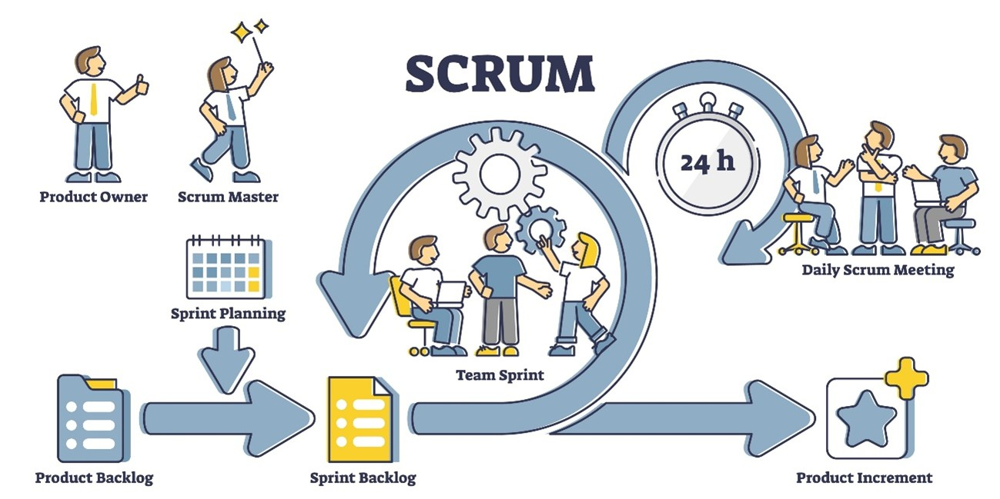

# Trabalho-Scrum-Grupo3
de desenvolvedores que está em busca de uma metodologia eficiente para o desenvolvimento de sistemas.
1. Definição e Características Principais
Definição: O Scrum é um framework (estrutura de trabalho) ágil, leve e de fácil compreensão, utilizado para o desenvolvimento, a entrega e a manutenção de produtos complexos. Ao contrário das metodologias tradicionais que exigem um planejamento rígido e detalhado no início (como o modelo em Cascata), o Scrum assume que o conhecimento vem da experiência e de tomar decisões com base no que é observado. Esta abordagem é conhecida como Empirismo.
O empirismo no Scrum apoia-se em três pilares fundamentais:
Transparência: O processo e o trabalho devem ser visíveis para aqueles que realizam e para os que recebem o trabalho.
Inspeção: Os utilizadores do Scrum devem inspecionar frequentemente os artefatos e o progresso em direção a um objetivo para deletar variações indesejadas.
Adaptação: Se algum aspecto do processo se desviar dos limites aceitáveis, o processo ou o material a ser produzido deve ser ajustado o mais rápido possível.

Shutterstock
Características Principais da Estrutura: A engrenagem do Scrum funciona através da combinação de três elementos centrais: Papéis, Eventos e Artefatos.
A Equipa Scrum (Papéis): É multifuncional e auto-gerida. Não há hierarquias tradicionais.
Product Owner (Dono do Produto): Representa o cliente. É responsável por maximizar o valor do produto, gerindo e priorizando a lista de requisitos.
Scrum Master: O facilitador. Remove impedimentos da equipa, garante que o Scrum é compreendido e aplicado corretamente, e protege a equipa de interrupções externas.
Developers (Programadores/Equipe Técnica): Os profissionais que de fato constroem o produto, comprometendo-se a entregar um incremento de software a funcionar a cada ciclo.
Os Ciclos (Eventos): Todo o trabalho ocorre dentro de blocos de tempo fixos (timeboxes).
Sprint: O ciclo principal, que dura de 1 a 4 semanas. É onde o trabalho acontece.
Sprint Planning: Planeamento do que será feito na Sprint atual.
Daily Scrum: Reunião diária (máx. 15 minutos) para a equipe técnica sincronizar o trabalho das próximas 24 horas.
Sprint Review: Reunião no final da Sprint para mostrar o software  funcionando aos stakeholders (interessados).
Sprint Retrospective: Reunião focada na melhoria contínua dos processos da própria equipe.
Os Artefatos: * Product Backlog: A lista de tudo o que é necessário para o produto.
Sprint Backlog: A lista de tarefas selecionadas para a Sprint atual.
Incremento: A soma de todos os itens do Backlog concluídos durante a Sprint (o software pronto a usar).

2. Tipos de Projetos Mais Adequados
O Scrum não é uma "bala de prata" que serve para tudo. Ele brilha em ambientes complexos e de alta incerteza.
·         Projetos com Requisitos Mutáveis: Se o cliente não sabe exatamente o que quer desde o início, ou se o mercado muda rapidamente, o Scrum é ideal. A cada Sprint, o rumo pode ser ajustado.
·         Desenvolvimento de Software Inovador e Startups: Criação de novos aplicativos, plataformas web SaaS (Software as a Service) ou MVPs (Minimum Viable Products). Nestes casos, o tempo de lançamento no mercado (Time-to-Market) é crucial, e o Scrum permite lançar versões básicas rapidamente e melhorá-las interativamente.
·         Modernização de Sistemas Legados: Quando se está a reescrever um sistema antigo, a equipe pode ir substituindo e entregando módulos aos poucos usando Sprints, em vez de tentar mudar tudo de uma vez.
Onde NÃO usar: Projetos simples, previsíveis e com escopo fechado (como a construção de um muro padrão ou a montagem de peças numa fábrica) não beneficiam do Scrum, pois a sobrecarga de reuniões (Daily, Review, Retrospective) não compensa.

3. Ferramentas Associadas
Para que a transparência e a colaboração ocorram (especialmente em equipes remotas ou híbridas), o mercado utiliza ferramentas digitais para gerir o Scrum. Elas ajudam a visualizar o fluxo de trabalho, geralmente utilizando quadros Kanban (Colunas: "A Fazer", "Em Progresso", "Concluído").
·         Jira Software (Atlassian): É a ferramenta líder de mercado em empresas de médio e grande porte. É altamente customizável, permite gerir backlogs gigantescos, planear Sprints, rastrear bugs (falhas) e gerar relatórios automáticos (como o Burndown Chart, que mostra a velocidade da equipe).
·         Trello: Muito visual e intuitivo, baseado em quadros. É excelente para startups, projetos de faculdade ou equipes de software menores. Não tem relatórios avançados como o Jira, mas a sua simplicidade é o seu maior trunfo.
·         Azure DevOps (Azure Boards): Muito forte em empresas que utilizam o ecossistema Microsoft. Tem a vantagem de integrar o planejamento das Sprints diretamente com o repositório de código (Git) e com a esteira de testes automatizados.
·         Confluence / Notion: Ferramentas associadas para documentação. Como o Scrum diz que "software a funcionar é mais importante que documentação abrangente", estas ferramentas servem para criar documentação técnica ágil, como regras de negócio e arquitetura, de forma colaborativa.

Olá! Parece que você está preparando um documento técnico sobre Scrum e organizando as diretrizes de formatação da ABNT para o seu editor de texto.

Para facilitar o seu trabalho, eu limpei e organizei o texto que você enviou. **Removi o parágrafo que estava duplicado** na seção sobre transparência e **excluí a frase promocional** do final, deixando o conteúdo com um tom formal e pronto para ser colado no seu trabalho acadêmico ou técnico.

Aqui está o texto revisado:

---

### Quais são as vantagens do Scrum?

Seja no desenvolvimento de software ou no setor médico, o Scrum facilita a execução do trabalho por meio de experimentação contínua e feedback constante, aprimorando a qualidade do produto. Embora essa seja apenas uma das qualidades, existem muitas outras vantagens nesse método. Vejamos algumas delas:

**Abordagem adaptável**
A abordagem Scrum baseia-se principalmente na adaptabilidade do projeto. Se a sua organização não possui objetivos predefinidos ou requisitos identificáveis ​​no início do projeto, o Scrum é uma metodologia extremamente útil. Opera principalmente em Sprints, onde as mudanças necessárias em uma Sprint podem ser implementadas em outra. Portanto, permite alterar qualquer projeto sem impactar os resultados.

**Altamente eficiente**
O Guia do Product Owner do Scrum enfatiza que o tamanho da equipe Scrum é tipicamente pequeno, garantindo que cada membro assuma total responsabilidade pelo seu trabalho, o que leva a uma melhoria na qualidade. Além disso, com o trabalho distribuído entre as equipes, a identificação oportuna de gargalos do produto e a implementação rápida de soluções tornam-se uma prática padrão.

**Promove a criatividade**
Durante o processo de desenvolvimento do produto, os projetos são monitorados continuamente. Isso permite que a equipe identifique áreas para melhoria e otimize o fluxo de trabalho. Consequentemente, são realizadas sessões de brainstorming com os membros da equipe para estimular ideias criativas e executar tarefas rotineiras.

**Reduz o custo do projeto**
Ao minimizar a documentação excessiva, planos de ação e histórias de usuário, o Scrum pode reduzir os custos indiretos em comparação com os métodos convencionais. Esses planos fornecem um roteiro claro e conciso para os desenvolvedores, permitindo que eles se concentrem nas tarefas atuais em vez de perder tempo com burocracia.

**Fornece feedback regular**
As reuniões diárias de Scrum facilitam a atualização do progresso, a identificação de impedimentos e a colaboração da equipe para manter o alinhamento com as metas da Sprint. Além disso, esse feedback diário ajuda o projeto a funcionar sem problemas a longo prazo.

**Transparente**
Como a metodologia envolve fornecer feedback regular e garantir a participação de cada membro da equipe, até mesmo pequenas modificações feitas no projeto (em qualquer nível) ficam visíveis para todos os membros da equipe. Dessa forma, constrói-se confiança e garante-se a entrega de produtos de melhor qualidade, promovendo ainda mais a transparência.

